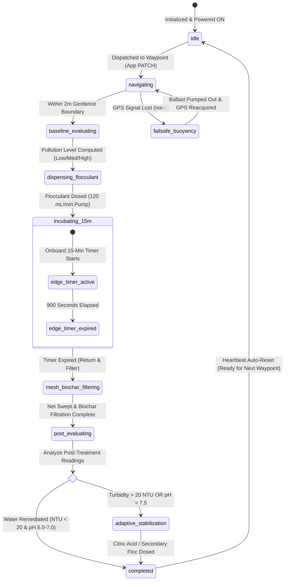

# Architecture Overview

This document explains HOW the SHELLOC backend system is organized, detailing its closed-loop bioremediation state machine, telemetry pipeline, data relationships, and AI integration.

## 1. System Context

**SHELLOC** (Smart Hydro-Environmental Locator and Cleaner) is an autonomous water-remediation robot that executes closed-loop bioremediation by deploying natural **Moringa-Chitosan flocculant** and **Citric Acid** to treat suspended particulate matter (SPM), restore water clarity, and stabilize aquatic pH in open water bodies.

### System Architecture Diagram

```mermaid
flowchart TD
    subgraph Robot Hardware [Robot Edge Hardware - Raspberry Pi / Matrix Mini R4]
        Sensors[Sensors: Turbidity, pH, TDS, Temp, SONAR, NoIR Camera]
        Actuators[Actuators: 120mL/min Floc Pump, Citric Acid Pump, Ballast Pump, Stirring Magnet]
        EdgeFSM[Onboard Edge FSM: 15-min Incubation Timer & Buoyancy Failsafe Controller]
        Comms[SIM808 / 4G Cellular Module]
    end

    subgraph Backend Infrastructure [FastAPI Backend Service]
        Auth[Auth & API Gateway]
        FSMService[Mission & Telemetry Service]
        WSManager[WebSocket Broadcast Manager]
        AIService[AI Engine: Google Gemini 3.7 Flash]
    end

    subgraph Data Tier [Persistence Layer]
        MongoDB[(MongoDB Database)]
    end

    subgraph Client Applications [Companion User Interfaces - 4-View Layout]
        WebPortal[Web Portal: Sidebar Nav]
        MobileApp[Mobile App: Bottom Tabs]
    end

    Sensors --> EdgeFSM
    Actuators <-- EdgeFSM
    EdgeFSM <--> Comms
    Comms -- GPRS / HTTP POST & WS Heartbeats --> Auth
    Auth --> FSMService
    FSMService <--> MongoDB
    FSMService --> WSManager
    WSManager -- Real-Time Broadcast (/ws/robot/{id}) --> WebPortal
    WSManager -- Real-Time Broadcast (/ws/robot/{id}) --> MobileApp
    WebPortal -- REST API (Dispatch / CRUD) --> Auth
    MobileApp -- REST API (Dispatch / CRUD) --> Auth
    FSMService <--> AIService
    AIService -- Grounded Telemetry Insights --> WebPortal
    AIService -- Grounded Telemetry Insights --> MobileApp
```

---

## 2. Closed-Loop Operational Lifecycle (9-State FSM)

SHELLOC operates on an adaptive, closed-loop state machine orchestrated on the edge and synchronized with the backend.



### State Definitions

1. **`idle`**: Robot is stationary in open water, awaiting mission dispatch. `target_waypoint_id` is null.
2. **`navigating`**: Robot is autonomously self-navigating toward the target waypoint coordinates using GPS and SONAR obstacle detection.
3. **`baseline_evaluating`**: Robot has entered the 2-meter geofence radius. It halts propulsion, stabilizes, and captures baseline sensor readings (Turbidity, pH, TDS, Temperature, NIR image).
4. **`dispensing_flocculant`**: System categorizes pollution level (Low: 20–50 mg/L, Med: 50–120 mg/L, High: 120–200 mg/L), activates the magnetic stirrer, and operates the 120 mL/min pump to dispense the exact Moringa-Chitosan dosage.
5. **`incubating_15m`**: The robot activates a local 15-minute (900s) countdown timer to allow macro-floc aggregation. The onboard controller broadcasts `timer_remaining_sec` over WebSockets every 5 seconds.
6. **`mesh_biochar_filtering`**: Upon timer completion, the robot maneuvers across the treatment zone to trap aggregated flocs via its collection mesh and filter dissolved pollutants through the biochar cartridge.
7. **`post_evaluating`**: Robot captures the `after` sensor reading suite to measure remediation delta.
8. **`adaptive_stabilization`**: If turbidity remains > 20 NTU, secondary Moringa-Chitosan is dosed; if pH is elevated (> 7.5), Citric Acid is dispensed via secondary pump to stabilize pH to target window (6.0–7.0).
9. **`completed`**: Waypoint is marked `treated = True`, treatment event summary is finalized, and mission state transitions back to `idle`.
10. **`failsafe_buoyancy`**: Triggered when `gps_signal == "none"`. The 120 mL/min circulation pump evacuates ballast water to elevate the antenna mast until GPS lock is restored.

---

## 3. Folder Structure

```text
app/
├── main.py          # App factory: FastAPI initialization, CORS, router mounting
├── core/            # Infrastructure & configuration
│   ├── config.py    # Environment settings via python-dotenv
│   ├── database.py  # Async Motor MongoDB connection pool
│   └── auth.py      # verify_api_key FastAPI dependency (X-API-Key)
├── models/          # MongoDB document schemas / typing
├── schemas/         # Pydantic v2 validation & response models
│   ├── sensor_reading.py
│   ├── robot_status.py
│   ├── treatment_event.py
│   ├── waypoint.py
│   └── chat_log.py
├── routers/         # Thin API controllers
│   ├── sensor_readings.py
│   ├── robot_status.py
│   ├── treatment_events.py
│   ├── waypoints.py
│   ├── ai_chat.py
│   └── websockets.py
├── services/        # Domain business logic
│   ├── ai_service.py         # Google Gemini integration & context grounding
│   └── connection_manager.py # WebSocket real-time broadcast registry
└── utils/           # BSON ObjectId helpers and serialization
```

---

## 4. Authentication Boundaries

- **Hardware Write Endpoints** (`POST /api/sensor-readings`, `POST /api/robot-status/{id}`, `POST /api/treatment-events`) require an `X-API-Key` header matching server configuration.
- **Client Read Endpoints & AI Chat** are unauthenticated for direct integration with companion Web and Mobile clients.

---

## 5. Database Schema & Collections

| Collection | Purpose | Key Indexes |
|---|---|---|
| `sensor_readings` | Before/After snapshots (Turbidity, pH, TDS, Temp, Obstacle Data) | `robot_id`, `waypoint_id`, `timestamp` descending |
| `waypoints` | GPS mission coordinates (max 6 per robot, 2m radius) | `robot_id` |
| `robot_status` | Real-time robot state, tank levels, incubation countdown, failsafes | `robot_id` unique |
| `treatment_events` | Comprehensive log of closed-loop cycles (Dual reagents, biochar, timer) | `robot_id`, `waypoint_id`, `started_at` descending |
| `ai_chat_logs` | Context-grounded multi-turn chat history | `user_id`, `timestamp` ascending |

---

## 6. AI Engine Architecture (Google Gemini)

SHELLOC utilizes **Google Gemini** (`gemini-3.7-flash` via the official `google-genai` SDK) as its dedicated AI engine.

### Operational Domain Grounding
The AI service dynamically builds a live context snapshot including:
- Current robot coordinates, mission state, and active timer.
- Consumable levels (Moringa-Chitosan tank %, Citric Acid tank %, Biochar health).
- Latest sensor readings across all waypoints.
- Environmental domain rules:
  - **Turbidity (NTU):** `< 20 NTU` = Remediated; `20–50 NTU` = Borderline; `> 50 NTU` = Critical/Severe.
  - **pH:** `< 6.0` = Acidic; `6.0–7.0` = Target stabilized window; `> 7.5` = Elevated alkaline (Citric Acid deployment required).
  - **TDS (ppm):** `> 400 ppm` = High particulate load; `~200–250 ppm` = Target remediated baseline.
  - **Closed-Loop Logic:** 15-minute incubation period, biochar filtration, and adaptive secondary dosing.

---

## 7. Edge vs. Cloud Responsibilities

| Responsibility | Edge Controller (Raspberry Pi) | Cloud Backend (FastAPI + Mongo) |
| :--- | :--- | :--- |
| **Sensor Sampling** | Reads analog/digital ADC channels (NTU, pH, TDS, Temp, SONAR) | Validates, timestamps, and indexes readings |
| **Actuator Control** | Controls 120 mL/min pumps, magnetic stirrer, ballast pump | Stores dispensing telemetry and dosage logs |
| **15-Min Timer** | **Runs onboard hardware countdown clock** | Receives remaining seconds & broadcasts to UI |
| **GPS Failsafe** | **Directly triggers ballast pump on signal loss** | Broadcasts `buoyancy_failsafe` alert to UI |
| **Offline Buffering**| Buffers telemetry during GPRS drops in local SQLite/JSON | Replays and ingests buffered data upon reconnect |
| **AI Insights** | N/A | Evaluates holistic telemetry via Google Gemini |
